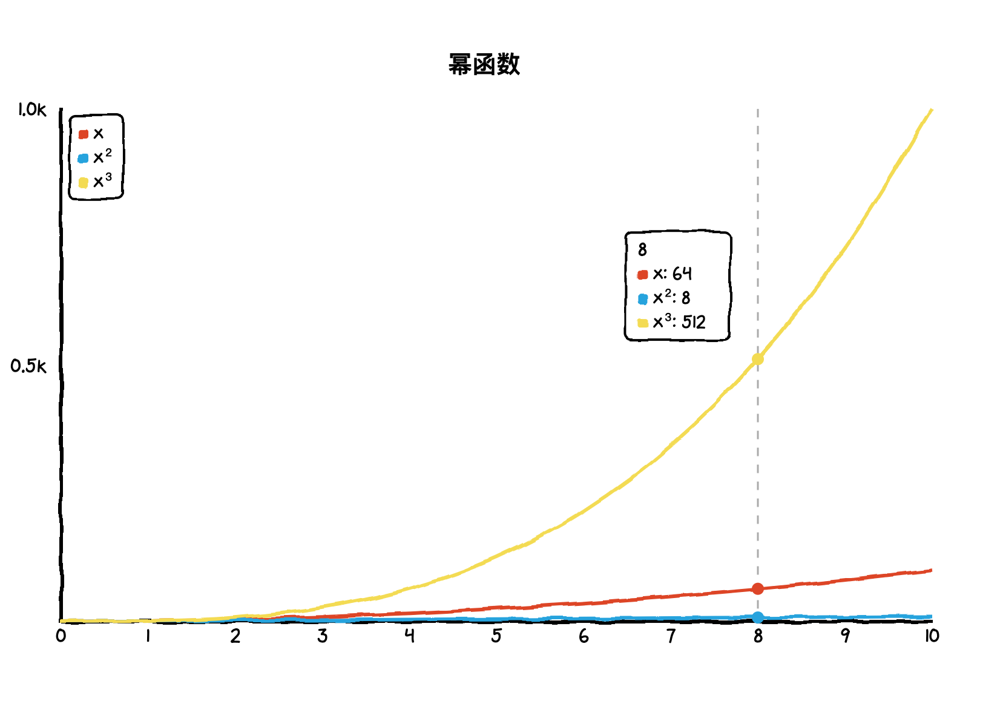
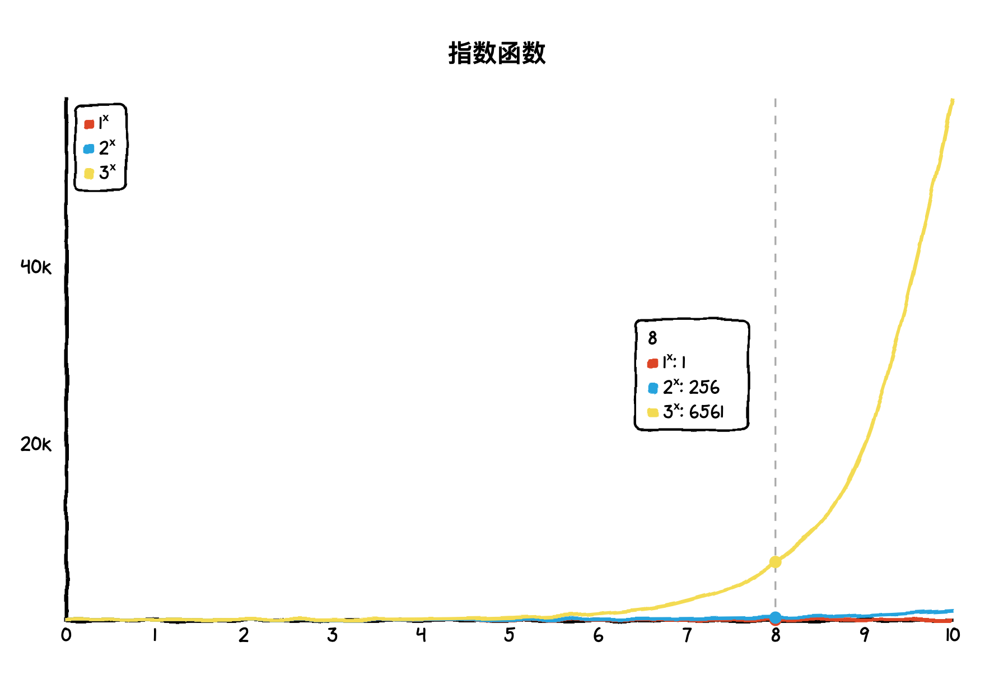
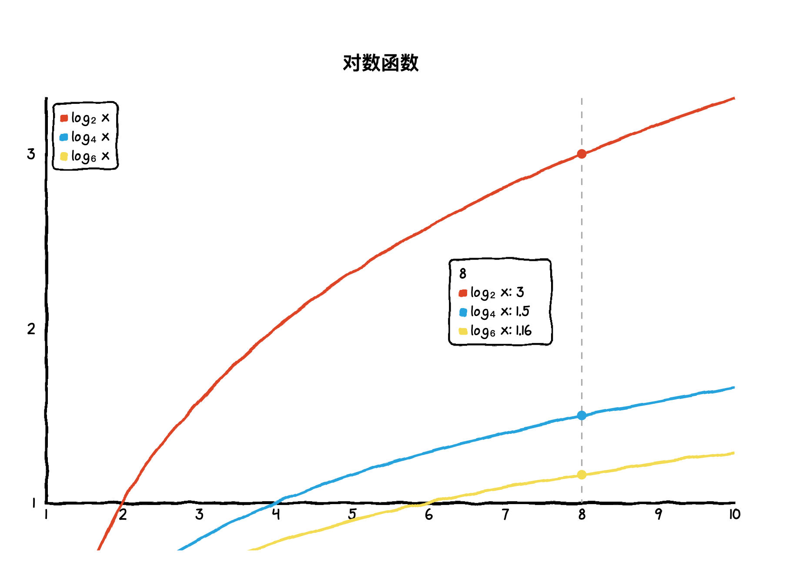

### 目录

- 基本运算
    - 一元运算符
    - 二元运算符
    - 位运算
    - 高级运算
- 函数
    - 对数函数
    - 幂函数
    - 指数函数
- 常见数列
- 数据分析
- 概率论与统计
- 定理
- 常见算法

## 基本运算
#### 一元运算符

|  符号     | 例子     | 含义       |
|  :----:   | :----:   | :----:     |
| -         | -2       | 2 的相反数 |
| ++        | ++2, 2++ | 2 自增     |
| --        | --2, 2-- | 2 自减     |
| !         | ! 2      | 非 2       |
| \|\|      | \|2\|    | 2 的绝对值 |
| ^         |       | 2 * 2 * 2 * 2 |
| √         |  | 2 的平方根 |
| ∜         |  | 2 的 4次 方根 |

#### 二元运算符

|  符号       | 例子     | 含义     |
|  :----:     | :----:   | :----:   |
| +           | 2 + 4    | 2 加上 4 |
| -           | 4 - 2    | 4 减去 2 |
| *           | 2 * 4    | 2 乘以 4 |
| %           | 2 % 4    | 2 对 4 取余 |
| /           | 2 / 4    | 2 除以 4 |
| =           | 2 = 2    | 2 等于 2 |
| ≠           | 2 ≠ 4    | 2 不等于 4 |
| ≈           | 2 ≈ 2.01    | 2 约等于 2.01 |
| ⪴           | 4 ⪴ 2    | 4 大于等于 2 |
| ⪳           | 2 ⪳ 4    | 2 小于等于 4 |
| ≪           | 2 ≪ 1000 | 2 远远小于 1000 |
| ≫           | 1000 ≫ 2    | 1000 远远大于 2 |

#### 位运算

|  符号     | 例子       | 含义     |
|  :----:   | :----:     | :----:   |
| ~         | ~100 = 011 | 按位取反 |
| \|        | 100 \| 010 = 110 | 按位或   |
| ^         | 100 ^ 010 = 110 | 按位异或 |
| &         | 100 & 010 = 000 | 按位与 |
| ≪         | 2 << 4 = 32 | 左移 |
| ≫         | 32 >> 4 = 2 | 右移 |

#### 高级运算

|  符号     | 例子     | 含义     |
|  :----:   | :----:   | :----:   |
| !         | 5!       | 5 * 4 * 3 * 2 * 1 |
| ∑         | | 2 + 3 + 4 + 5 |
| ∏         | | 2 * 3 * 4 * 5 |

## 函数

#### 幂函数

##### 运算法则
- 
- 
- 
- 
- 
- 

#### 指数函数

##### 运算法则

#### 对数

|  符号     | 例子     | 含义       |
|  :----:   | :----:   | :----:     |
| log       |  = 2 | 以 10 为底，100 的对数 |
| ln       | | 等于   |

##### 运算法则
- 
- 
- 
- 
- 
- 
- 
- 

#### 线性代数

