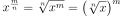
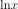
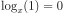
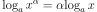

### 目录

- 运算
    - 一元运算符
    - 二元运算符
    - 位运算
    - 高级运算
- 函数
    - 对数函数
    - 幂函数
    - 指数函数
- 数列
- 概率论与统计
- 定理
- 算法

## 运算
### 一元运算符

|  符号     | 例子     | 含义       |
|  :----:   | :----:   | :----:     |
| -         | -2       | 2 的相反数 |
| ++        | ++2, 2++ | 2 自增     |
| --        | --2, 2-- | 2 自减     |
| !         | ! 2      | 非 2       |
| \|\|      | \|2\|    | 2 的绝对值 |
| ^         |       | 2 * 2 * 2 * 2 |
| √         |  | 2 的平方根 |
| ∜         |  | 2 的 4次 方根 |

### 二元运算符

|  符号       | 例子     | 含义     |
|  :----:     | :----:   | :----:   |
| +           | x + y    | x 加上 y |
| -           | x - y    | x 减去 y |
| *           | x * y    | x 乘以 y |
| %           | x * y    | x 乘以 y |
| /           | x / y    | x 除以 y |
| =           | x = y    | x 等于 y |
| ≠           | x ≠ y    | x 不等于 y |
| ≈           | x ≈ y    | x 约等于 y |
| ⪴           | x ⪴ y    | x 大于等于 y |
| ⪳           | x ⪳ y    | x 小于等于 y |
| ≪           | x ≪ y    | x 远远小于 y |
| ≫           | x ≫ y    | x 远远大于 y |

### 位运算

|  符号     | 例子       | 含义     |
|  :----:   | :----:     | :----:   |
| ~         | ~100 ⇒ 011 | 按位取反 |
| \|        | 100 \| 010 ⇒ 110 | 按位或   |
| ^         | 100 ^ 010 ⇒ 110 | 按位异或 |
| &         | 100 & 010 ⇒ 000 | 按位与 |

### 高级运算

|  符号     | 例子     | 含义     |
|  :----:   | :----:   | :----:   |
| !         | 5!       | 5 * 4 * 3 * 2 * 1 |
| ∑         | | 2 + 3 + 4 + 5 |
| ∏         | | 2 * 3 * 4 * 5 |

### 幂函数
增长曲线

#### 运算法则
- 
- 
- 
- 
- 
- 

### 指数函数

#### 运算法则

### 对数

|  符号     | 例子     | 含义       |
|  :----:   | :----:   | :----:     |
| log       | | 等于 2，因为 10^2 = 100 |
| ln       | | 等于   |

#### 运算法则
- 
- 
- 
- 
- 
- 
- 
- 

### 线性代数

